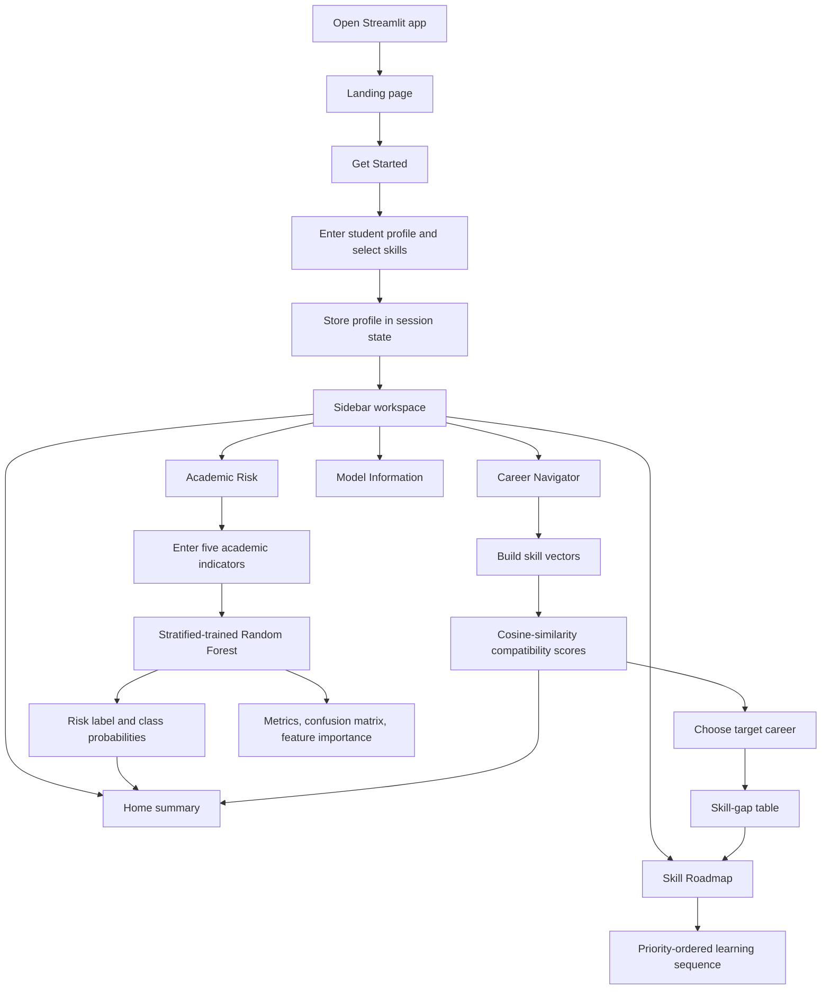

# A Machine Learning-Based Academic Risk Prediction & Career Guidance System

An interactive Streamlit workspace that combines academic-risk classification with skill-based career guidance and a rule-based learning roadmap.

## 📌 Overview

Students often need two kinds of direction at the same time: an indication of where their current academic indicators may place them, and a practical way to connect their existing skills with possible career paths. This project brings those concerns into one small, explainable application.

The academic component uses a Random Forest Classifier to estimate one of three risk levels from five academic indicators. The career component compares selected technical skills with hand-created, weighted career requirements using cosine similarity. A separate rule-based roadmap then orders missing skills by priority for the selected career.

These components are presented together through a shared student profile and sidebar navigation. The career matcher and roadmap do not use the academic prediction as an input, and the academic model does not use career or skill selections as features.

## 🎯 Objectives

- Classify a student into `Low Risk`, `Medium Risk`, or `High Risk` from academic indicators.
- Provide a skill-compatibility comparison across six predefined technology careers.
- Highlight which required skills a student already has and which are missing for a selected career.
- Generate a simple learning sequence from missing-skill priority and importance.
- Present prediction confidence, model metrics, feature importance, and a confusion matrix in an accessible interface.
- Keep the two analytical components understandable and separate within one student workspace.

## ✨ Key Features

### Academic Risk Prediction

- Inputs for attendance, assignment completion, quiz average, previous marks, and study hours per week.
- Random Forest classification into three risk levels.
- Per-class prediction probabilities shown after prediction.
- Top three overall feature-importance factors from the trained forest.
- Accuracy, weighted precision, weighted recall, weighted F1-score, class metrics, and confusion matrix.

### Career Guidance

- Compatibility scores for Data Analyst, Data Scientist, Machine Learning Engineer, Full Stack Developer, Cloud Engineer, and Cybersecurity Analyst.
- Cosine similarity between the student's binary skill vector and each career's weighted skill vector.
- Compatibility results sorted from highest to lowest.
- A clear note that compatibility is not job-placement prediction.

### Student Profile and Roadmap

- Onboarding form for name, year of study, CGPA, current technical skills, and target career.
- Editable profile details stored in Streamlit session state.
- Skill-gap table showing required skill, importance, whether the student has it, and priority if missing.
- Rule-based roadmap ordered by high, medium, then low priority, with importance used as a tie-breaker.
- Suggested topics and a small project application idea for a selected missing skill.

### Workspace and Visualizations

- Landing page with a student-success workspace introduction and a `Get Started` flow.
- Sidebar navigation for Home, Career Navigator, Academic Risk, Skill Roadmap, and Model Information.
- Home summary with profile, career compatibility, skill gaps, and current academic-risk label.
- Compatibility progress bars, risk cards, metric cards, data tables, bar charts, and a visual roadmap.
- Responsive custom CSS styling for the Streamlit interface.

## 🧠 Machine Learning Approach

### 1. Data

The academic model reads `student_data.csv` with five numeric feature columns and one categorical target column, `Risk_Level`. The repository also contains a function that can generate reproducible synthetic academic records, but the training pipeline loads the checked-in CSV.

### 2. Features

The Random Forest uses:

- `Attendance`
- `Assignment_Completion`
- `Quiz_Average`
- `Previous_Marks`
- `Study_Hours`

The target is `Risk_Level`, with the classes `Low Risk`, `Medium Risk`, and `High Risk`.

### 3. Preprocessing

The code selects the five numeric columns, separates them from the target, and performs a stratified train/test split. No scaling, encoding, imputation, or other preprocessing transformation is applied.

### 4. Model

The academic model is `sklearn.ensemble.RandomForestClassifier` configured with 300 trees, maximum depth 12, minimum split size 4, minimum leaf size 2, balanced class weights, a fixed random state of 42, and parallel training.

Career matching is not a trained machine-learning model. It uses `sklearn.metrics.pairwise.cosine_similarity` over a binary student skill vector and weighted career requirement vectors.

### 5. Training

`train_and_evaluate_model()` loads the CSV, creates a stratified 75/25 split, trains the Random Forest, saves the fitted estimator to `trained_model.pkl`, and returns evaluation results. In the Streamlit app, this result is cached as a resource so training happens once per app session.

### 6. Prediction

The academic page collects one set of slider values, creates a one-row DataFrame in the same feature order used for training, and calls `predict()` and `predict_proba()`. The career page creates skill vectors and calculates one compatibility percentage per career.

### 7. Evaluation

Evaluation is performed on the held-out test portion using accuracy, weighted precision, weighted recall, weighted F1-score, per-class classification metrics, and a confusion matrix. Feature importance is read from the Random Forest's built-in `feature_importances_` attribute.

## 📊 Dataset

### Academic Dataset

| Property | Details |
|---|---|
| File | `student_data.csv` |
| Records | 1,000 |
| Features | Attendance, assignment completion, quiz average, previous marks, study hours |
| Target | `Risk_Level` |
| Target classes | Low Risk, Medium Risk, High Risk |
| Data type | Numeric academic indicators with categorical risk labels |
| Class counts | Low Risk: 334; Medium Risk: 333; High Risk: 333 |
| Source | Synthetic academic data generated by the project code and stored in the CSV |

The CSV is used directly for Random Forest training and held-out evaluation. It is not presented as real student or institutional data.

### Career Skill Dataset

Career requirements are stored in `career_data.py` as a small hand-created mapping of six careers to skill-importance weights from 0.0 to 1.0. This is not scraped job-posting data and is used only for compatibility, gap analysis, and roadmap ordering.

## 📈 Model Performance

The current training configuration produces the following values on the 250-record held-out test set from the repository CSV:

| Metric | Value |
|---|---:|
| Accuracy | 0.732000 |
| Weighted precision | 0.753030 |
| Weighted recall | 0.732000 |
| Weighted F1-score | 0.737215 |

Per-class results from the same run:

| Risk level | Precision | Recall | F1-score | Support |
|---|---:|---:|---:|---:|
| Low Risk | 0.822785 | 0.773810 | 0.797546 | 84 |
| Medium Risk | 0.582524 | 0.722892 | 0.645161 | 83 |
| High Risk | 0.852941 | 0.698795 | 0.768212 | 83 |

The application exposes these metrics, the confusion matrix, and feature-importance charts in the Academic Risk and Model Information pages. These results come from one fixed train/test split and should be interpreted in the context of the synthetic dataset.

## 🧭 Career Guidance / Recommendation System

The career component follows this sequence:

1. The student selects current technical skills during onboarding.
2. Each selected skill becomes `1` in a vector covering all skills in `career_data.py`; unselected skills become `0`.
3. Each career is represented by a vector containing its hand-created skill-importance weights.
4. Cosine similarity produces a compatibility percentage for every career, which is displayed in descending order.
5. The student chooses a target career.
6. The application compares the selected skills with that career's required skills and marks each one as present or missing.
7. Missing skills are ordered by high, medium, and low priority, then by importance. The roadmap adds suggested topics and a small project idea for a selected skill.

The roadmap and recommendations are deterministic comparisons and Python rules. There is no external AI API, language model, job-market feed, or real-time recommendation service in the implementation.

## 🔄 System Workflow



## 🖥️ Application Interface

The application is a Streamlit web interface with a custom light visual theme defined in `app.py`.

- **Landing page:** introduces the workspace and presents `Get Started`.
- **Profile onboarding:** collects name, year of study, CGPA, current technical skills, and target career.
- **Home:** summarizes academic profile, current risk, target-career compatibility, skill gaps, and a compatibility chart.
- **Career Navigator:** displays selected skills, sorted compatibility cards, target-career selection, and a skill-gap table.
- **Academic Risk:** provides five sliders, a prediction action, class probabilities, important factors, evaluation metrics, and detailed tables.
- **Skill Roadmap:** shows current skills, gaps, recommended learning, project applications, and the target career in a connected visual layout.
- **Model Information:** explains cosine similarity and Random Forest in plain language and exposes evaluation details.

No screenshots or image assets are currently present in the repository. The code references `assets/student_hero.jpg`, but the `assets` directory is empty, so the app uses its CSS fallback visual when that file is unavailable.

## 🛠️ Technology Stack

| Category | Technology |
|---|---|
| Language | Python |
| Framework | Streamlit |
| Machine Learning | scikit-learn: `RandomForestClassifier`, cosine similarity |
| Data Processing | pandas, NumPy |
| Model Persistence | joblib |
| Visualization | Streamlit metrics, progress bars, dataframes, bar charts, and custom HTML/CSS |
| Frontend/UI | Streamlit widgets with custom CSS in `app.py` |
| Deployment | Local Streamlit execution; no deployment configuration is included |

## 📂 Project Structure

```text
ML_Student_career_navigator/
├── app.py               # Streamlit interface, navigation, styling, and UI logic
├── career_data.py       # Hand-created career-to-skill importance mappings
├── model.py             # Dataset loading, Random Forest training, evaluation, and prediction
├── student_data.csv     # 1,000-row synthetic academic-risk dataset
├── trained_model.pkl    # Saved Random Forest artifact generated by model training
├── requirements.txt     # Runtime Python dependencies
└── assets/              # Present but currently empty
```

The repository also contains a local `venv/` and Python bytecode cache in the working directory; these are environment artifacts rather than application source files.

## ⚙️ Installation & Setup

1. Clone the repository:

   ```bash
   git clone https://github.com/shazfa13/ML_Student_career_navigator.git
   ```

2. Enter the project directory:

   ```bash
   cd ML_Student_career_navigator
   ```

3. Create and activate a virtual environment (recommended).

   **Windows PowerShell:**

   ```powershell
   python -m venv venv
   .\venv\Scripts\Activate.ps1
   ```

   **macOS/Linux:**

   ```bash
   python -m venv venv
   source venv/bin/activate
   ```

4. Install the dependencies:

   ```bash
   pip install -r requirements.txt
   ```

5. Start the Streamlit application:

   ```bash
   streamlit run app.py
   ```

The terminal will provide the local URL, typically `http://localhost:8501`.

## 🚀 Usage

1. Open the local Streamlit URL and select **Get Started**.
2. Enter a student name, choose a year of study, set a CGPA, select current technical skills, and choose an initial target career.
3. Select **Continue** to enter the workspace.
4. Use **Home** for a combined snapshot of the profile, career match, skill gaps, and current academic-risk label.
5. Open **Career Navigator** to review compatibility scores, change the target career, and inspect the skill-gap table.
6. Open **Academic Risk**, adjust the five academic sliders, and select **Predict Academic Risk** to see the predicted label and class probabilities.
7. Review important factors and held-out evaluation results on the Academic Risk page or **Model Information** page.
8. Open **Skill Roadmap** to explore the priority-ordered missing skills, suggested topics, and small project applications.

## 📌 Example Workflow

A student can begin by entering their profile and selecting the technical skills they already have. They can compare the six displayed career compatibility scores, choose one target career, inspect which required skills are missing, and then open the roadmap to see a priority-ordered learning sequence. Separately, they can enter their five academic indicators and request an academic-risk estimate with its class probabilities.

The application does not guarantee a career outcome or an academic decision; it provides the comparisons and estimates implemented by this project.

## 🔮 Future Enhancements

The following are future possibilities, not current features:

- Replace or supplement the synthetic academic records with a larger, ethically collected real-world dataset.
- Add cross-validation and broader validation across multiple train/test splits.
- Compare additional suitable classification algorithms.
- Add stronger personalization that connects academic support signals with the selected learning roadmap.
- Expand and maintain career skill requirements using current, responsibly sourced data.
- Add explainability methods beyond built-in Random Forest feature importance.
- Add deployment configuration and automated testing for hosted use.

## 👩‍💻 Author

**Name:** Shazfa Khursheed Mysha

**GitHub:** [shazfa13](https://github.com/shazfa13)

## 📜 License

No license has currently been specified for this repository.